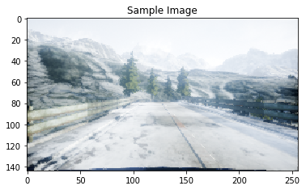

# Step 0 - 数据挖掘与准备

## 概述

我们的目标是训练一种深度学习模型，该模型可以根据包括摄像机图像和车辆最后已知状态的输入来预测转向角度。在本笔记本中，我们将为我们的端到端深度学习模型准备数据。在此过程中，我们还将对数据集进行一些有用的观察，这些观察将在训练模型时帮助我们。


## 什么是端到端深度学习?

端到端深度学习是一种建模策略，是对深度神经网络成功的一种回应。与传统方法不同，这种策略不是建立在特征工程的基础上。相反，它利用了深度神经网络的力量，以及最近硬件的进步(gpu, fpga等)来利用大量数据的惊人潜力。它比传统的ML更接近于类人学习方法，因为它让神经网络将原始输入映射到直接输出。这种方法的一大缺点是需要大量的训练数据，这使得它不适合许多常见的应用程序。由于模拟器可以(潜在地)生成无限数量的数据，它们是端到端深度学习算法的完美数据源。如果你想了解更多，[这个视频由Andrew Ng提供了一个很好的主题概述](https://www.coursera.org/learn/machine-learning-projects/lecture/k0Klk/what-is-end-to-end-deep-learning)。

自动驾驶是一个可以从端到端深度学习的力量中受益的领域。为了达到SAE 4级或5级的自动驾驶水平，汽车需要对大量的数据进行训练(汽车制造商每周收集数百拍字节的数据并不罕见)，如果没有模拟器，这几乎是不可能的。
有了像[AirSim](https://github.com/Microsoft/AirSim)这样的逼真的模拟器，现在可以收集大量的数据来训练你的自动驾驶模型，而不需要使用真正的汽车。然后，这些模型可以使用相对较少的实际数据进行微调，并用于实际的汽车。这种技术被称为行为克隆。在本教程中，您将训练一个模型来学习如何在AirSim中驾驶汽车通过景观地图的一部分，只使用汽车上的一个前置摄像头作为视觉输入。我们的战略将是执行一些基本的数据分析,了解数据集,然后火车一个端到端的深度学习模型来预测正确的驾驶控制信号(在这种情况下,转向角)给定一个帧的摄像头,和汽车的当前状态参数(速度、转向角、油门等)。
在开始之前，请确保下载了教程所需的数据集。如果您错过了自述文件中的说明，您可以[从这里下载数据集](https://aka.ms/AirSimTutorialDataset)。
让我们从导入一些标准库开始。

**注意:如果你在这些笔记本中的一些注释中看到<<...>>之间的文本， 这意味着您需要对附带的代码进行更改**


```python
%matplotlib inline
import numpy as np
import pandas as pd
import h5py
import matplotlib.pyplot as plt
from PIL import Image, ImageDraw
import os
import Cooking
import random

# << 配置下载的数据集目录 >>
RAW_DATA_DIR = '../../AirSim/EndToEndLearningRawData/data_raw/'

# << 配置预处理后(*.h5)的输出目录 >>
COOKED_DATA_DIR = '../../AirSim/EndToEndLearningRawData/data_cooked/'

# The folders to search for data under RAW_DATA_DIR
# For example, the first folder searched will be RAW_DATA_DIR/normal_1
DATA_FOLDERS = ['normal_1', 'normal_2', 'normal_3', 'normal_4', 'normal_5', 'normal_6', 'swerve_1', 'swerve_2', 'swerve_3']

# The size of the figures in this notebook
FIGURE_SIZE = (10,10)
```

让我们看看原始数据。数据集有两部分——图像和.tsv文件。首先，让我们读一个.tsv文件。


```python
sample_tsv_path = os.path.join(RAW_DATA_DIR, 'normal_1/airsim_rec.txt')
sample_tsv = pd.read_csv(sample_tsv_path, sep='\t')
sample_tsv.head()
```


<div>
<style scoped>
    .dataframe tbody tr th:only-of-type {
        vertical-align: middle;
    }

    .dataframe tbody tr th {
        vertical-align: top;
    }

    .dataframe thead th {
        text-align: right;
    }
</style>
<table border="1" class="dataframe">
  <thead>
    <tr style="text-align: right;">
      <th></th>
      <th>Timestamp</th>
      <th>Speed (kmph)</th>
      <th>Throttle</th>
      <th>Steering</th>
      <th>Brake</th>
      <th>Gear</th>
      <th>ImageName</th>
    </tr>
  </thead>
  <tbody>
    <tr>
      <th>0</th>
      <td>93683464</td>
      <td>0</td>
      <td>0.0</td>
      <td>0.000000</td>
      <td>0.0</td>
      <td>N</td>
      <td>img_0.png</td>
    </tr>
    <tr>
      <th>1</th>
      <td>93689595</td>
      <td>0</td>
      <td>0.0</td>
      <td>0.000000</td>
      <td>0.0</td>
      <td>N</td>
      <td>img_1.png</td>
    </tr>
    <tr>
      <th>2</th>
      <td>93689624</td>
      <td>0</td>
      <td>0.0</td>
      <td>-0.035522</td>
      <td>0.0</td>
      <td>N</td>
      <td>img_2.png</td>
    </tr>
    <tr>
      <th>3</th>
      <td>93689624</td>
      <td>0</td>
      <td>0.0</td>
      <td>-0.035522</td>
      <td>0.0</td>
      <td>N</td>
      <td>img_3.png</td>
    </tr>
    <tr>
      <th>4</th>
      <td>93689624</td>
      <td>0</td>
      <td>0.0</td>
      <td>-0.035522</td>
      <td>0.0</td>
      <td>N</td>
      <td>img_4.png</td>
    </tr>
  </tbody>
</table>
</div>


该数据集包含我们的标签，即转向角度。它也有在方向盘角度被记录时所拍摄的图像的名称。让我们看一个示例图像- 'normal_1'文件夹中的'img_0.png'(稍后会详细介绍文件夹命名风格)。


```python
sample_image_path = os.path.join(RAW_DATA_DIR, 'normal_1/images/img_0.png')
sample_image = Image.open(sample_image_path)
plt.title('Sample Image')
plt.imshow(sample_image)
plt.show()
```





我们可以立即观察到的一个现象是，**图像中只有一小部分是有趣的（only a small portion of the image is of interest）**。例如，我们应该能够通过关注下图中红色部分的ROI来决定如何驾驶汽车


```python
sample_image_roi = sample_image.copy()

fillcolor=(255,0,0)
draw = ImageDraw.Draw(sample_image_roi)
points = [(1,76), (1,135), (255,135), (255,76)]
for i in range(0, len(points), 1):
    draw.line([points[i], points[(i+1)%len(points)]], fill=fillcolor, width=3)
del draw

plt.title('Image with sample ROI')
plt.imshow(sample_image_roi)
plt.show()
```


**提取此ROI将减少训练时间和训练模型所需的数据量**。它还可以防止模型因关注环境中不相关的特征(如山、树等)而混淆。

我们可以做的另一个观察是，**数据集显示出垂直翻转的容忍度**。也就是说，我们得到了一个有效的数据点如果我们将图像绕Y轴翻转如果我们也翻转转向角的符号。这一点非常重要，因为它有效地将我们现有的数据点数量增加了一倍。

此外，**训练的模型应该对光照条件的变化保持不变**，因此我们可以通过全局缩放图像的亮度来生成额外的数据点。


> **思考练习 0.1:** 
一旦您完成了本教程，作为一个练习，您应该尝试使用提供的数据集，而不使用上面描述的3个更改中的一个或多个更改来修改它，保持其他所有内容不变。你会体验到截然不同的结果吗?


> **思考练习 0.2:**
我们在Readme中提到，端到端深度学习在将数据输入到学习算法之前，消除了手工特征工程的需要。您会考虑将这些对数据集进行的预处理更改作为工程特性吗?为什么或为什么不?

现在，让我们将所有非图像数据聚合到一个数据帧中，以获得更多的见解。


```python
full_path_raw_folders = [os.path.join(RAW_DATA_DIR, f) for f in DATA_FOLDERS]

dataframes = []
for folder in full_path_raw_folders:
    current_dataframe = pd.read_csv(os.path.join(folder, 'airsim_rec.txt'), sep='\t')
    current_dataframe['Folder'] = folder
    dataframes.append(current_dataframe)
    
dataset = pd.concat(dataframes, axis=0)

print('Number of data points: {0}'.format(dataset.shape[0]))

dataset.head()
```

    Number of data points: 46738
    


<div>
<style scoped>
    .dataframe tbody tr th:only-of-type {
        vertical-align: middle;
    }

    .dataframe tbody tr th {
        vertical-align: top;
    }

    .dataframe thead th {
        text-align: right;
    }
</style>
<table border="1" class="dataframe">
  <thead>
    <tr style="text-align: right;">
      <th></th>
      <th>Timestamp</th>
      <th>Speed (kmph)</th>
      <th>Throttle</th>
      <th>Steering</th>
      <th>Brake</th>
      <th>Gear</th>
      <th>ImageName</th>
      <th>Folder</th>
    </tr>
  </thead>
  <tbody>
    <tr>
      <th>0</th>
      <td>93683464</td>
      <td>0</td>
      <td>0.0</td>
      <td>0.000000</td>
      <td>0.0</td>
      <td>N</td>
      <td>img_0.png</td>
      <td>../../AirSim/EndToEndLearningRawData/data_raw/...</td>
    </tr>
    <tr>
      <th>1</th>
      <td>93689595</td>
      <td>0</td>
      <td>0.0</td>
      <td>0.000000</td>
      <td>0.0</td>
      <td>N</td>
      <td>img_1.png</td>
      <td>../../AirSim/EndToEndLearningRawData/data_raw/...</td>
    </tr>
    <tr>
      <th>2</th>
      <td>93689624</td>
      <td>0</td>
      <td>0.0</td>
      <td>-0.035522</td>
      <td>0.0</td>
      <td>N</td>
      <td>img_2.png</td>
      <td>../../AirSim/EndToEndLearningRawData/data_raw/...</td>
    </tr>
    <tr>
      <th>3</th>
      <td>93689624</td>
      <td>0</td>
      <td>0.0</td>
      <td>-0.035522</td>
      <td>0.0</td>
      <td>N</td>
      <td>img_3.png</td>
      <td>../../AirSim/EndToEndLearningRawData/data_raw/...</td>
    </tr>
    <tr>
      <th>4</th>
      <td>93689624</td>
      <td>0</td>
      <td>0.0</td>
      <td>-0.035522</td>
      <td>0.0</td>
      <td>N</td>
      <td>img_4.png</td>
      <td>../../AirSim/EndToEndLearningRawData/data_raw/...</td>
    </tr>
  </tbody>
</table>
</div>


现在让我们处理数据集文件夹的命名问题。你会注意到我们的数据集中有两种类型的文件夹——‘normal’和‘swerve’。这些名字指的是两种不同的驾驶策略。让我们先来了解一下这两种驾驶方式的不同之处。首先，我们将绘制来自每种驾驶风格的数据点的一部分。


```python
min_index = 100
max_index = 1100
steering_angles_normal_1 = dataset[dataset['Folder'].apply(lambda v: 'normal_1' in v)]['Steering'][min_index:max_index]
steering_angles_swerve_1 = dataset[dataset['Folder'].apply(lambda v: 'swerve_1' in v)]['Steering'][min_index:max_index]

plot_index = [i for i in range(min_index, max_index, 1)]

fig = plt.figure(figsize=FIGURE_SIZE)
ax1 = fig.add_subplot(111)

ax1.scatter(plot_index, steering_angles_normal_1, c='b', marker='o', label='normal_1')
ax1.scatter(plot_index, steering_angles_swerve_1, c='r', marker='o', label='swerve_1')
plt.legend(loc='upper left');
plt.title('Steering Angles for normal_1 and swerve_1 runs')
plt.xlabel('Time')
plt.ylabel('Steering Angle')
plt.show()
```


在这里我们可以看到两种驾驶策略的明显区别。蓝点显示的是正常的驾驶策略，如你所料，它使你的转向角度或多或少接近于零，这使你的车在道路上大部分直行。

急转弯驾驶策略使得车辆几乎在马路上左右摇摆。这说明了在训练端到端深度学习模型时要记住的一件非常重要的事情。因为我们没有做任何特征工程，所以我们的模型几乎完全依赖于数据集来提供它在回忆过程中需要的所有必要信息。因此，为了考虑到模型可能遇到的任何急转弯，并在它开始偏离道路时给予它自我纠正的能力，我们需要在训练时为它提供足够的这样的例子。因此，我们创建了这些额外的数据集来关注这些场景。一旦你完成了教程，你可以尝试只使用“正常”数据集重新运行所有内容，并看到你的汽车在道路上停留了很长一段时间。

- **思考练习 0.3**
您认为在这个转向角度预测场景中还需要什么其他的数据收集技术?那么一般的自动驾驶呢?
现在，让我们看看每个类别中的数据点数量。


```python
dataset['Is Swerve'] = dataset.apply(lambda r: 'swerve' in r['Folder'], axis=1)
grouped = dataset.groupby(by=['Is Swerve']).size().reset_index()
grouped.columns = ['Is Swerve', 'Count']

def make_autopct(values):
    def my_autopct(percent):
        total = sum(values)
        val = int(round(percent*total/100.0))
        return '{0:.2f}%  ({1:d})'.format(percent,val)
    return my_autopct

pie_labels = ['Normal', 'Swerve']
fig, ax = plt.subplots(figsize=FIGURE_SIZE)
ax.pie(grouped['Count'], labels=pie_labels, autopct = make_autopct(grouped['Count']))
plt.title('Number of data points per driving strategy')
plt.show()
```


因此，大约四分之一的数据点是通过转向驾驶策略收集的，其余的数据点是通过普通驾驶策略收集的。我们还看到，我们有近47000个数据点需要处理。这是几乎不够的数据，因此我们的网络不能太深。

- **思考练习0.4**
就像机器学习领域的许多东西一样，这里每个类别中数据点的理想比例是特定于问题的，只能通过试错来优化。你能找个比我们的更好的吗?
我们来看看这两种策略的标签分布。


```python
bins = np.arange(-1, 1.05, 0.05)
normal_labels = dataset[dataset['Is Swerve'] == False]['Steering']
swerve_labels = dataset[dataset['Is Swerve'] == True]['Steering']

def steering_histogram(hist_labels, title, color):
    plt.figure(figsize=FIGURE_SIZE)
    # 此处需要修改：as_matrix()修改为values
    n, b, p = plt.hist(hist_labels.values, bins, normed=1, facecolor=color)
    plt.xlabel('Steering Angle')
    plt.ylabel('Normalized Frequency')
    plt.title(title)
    plt.show()

steering_histogram(normal_labels, 'Normal label distribution', 'g')
steering_histogram(swerve_labels, 'Swerve label distribution', 'r')

```


我们可以对这些图表中的数据进行一些观察:
- **正常驾驶时，方向盘角度几乎总是为零**。存在严重的不平衡，如果这部分数据没有**下采样**，模型将始终预测为零，汽车将无法转弯。
- **当使用转向策略驾驶汽车时，我们得到了一些在常规策略数据集中不会出现的急转弯的例子。**这证实了我们收集上述数据的理由
此时，我们需要将原始数据合并成适合于训练的压缩数据文件。在这里，我们将使用.h5文件，因为这种格式非常适合支持大型数据集，而不需要一次性将所有数据读取到内存中。它也与Keras无缝合作。
生成数据集的代码很简单，但是很长。当它终止时，最终的数据集将有4部分:
- **image**:包含图像数据的numpy数组
- **previous_state**: numpy数组，包含汽车的最后一个已知状态。这是一个(转向，油门，刹车，速度)元组
- **label**: numpy数组，包含我们希望预测的转向角度(在-1..1范围内归一化)
- **metadata**: numpy数组，包含关于文件的元数据(它们来自哪个文件夹，等等)
处理过程可能需要一些时间。我们还会将所有的数据集合并成一个，然后将其拆分为训练/测试/验证数据集。


```python
train_eval_test_split = [0.7, 0.2, 0.1]
full_path_raw_folders = [os.path.join(RAW_DATA_DIR, f) for f in DATA_FOLDERS]
Cooking.cook(full_path_raw_folders, COOKED_DATA_DIR, train_eval_test_split)
```

    Reading data from ../../AirSim/EndToEndLearningRawData/data_raw/normal_1...
    Reading data from ../../AirSim/EndToEndLearningRawData/data_raw/normal_2...
    Reading data from ../../AirSim/EndToEndLearningRawData/data_raw/normal_3...
    Reading data from ../../AirSim/EndToEndLearningRawData/data_raw/normal_4...
    Reading data from ../../AirSim/EndToEndLearningRawData/data_raw/normal_5...
    Reading data from ../../AirSim/EndToEndLearningRawData/data_raw/normal_6...
    Reading data from ../../AirSim/EndToEndLearningRawData/data_raw/swerve_1...
    Reading data from ../../AirSim/EndToEndLearningRawData/data_raw/swerve_2...
    Reading data from ../../AirSim/EndToEndLearningRawData/data_raw/swerve_3...
    Processing ../../AirSim/EndToEndLearningRawData/data_cooked/train.h5...
    Finished saving ../../AirSim/EndToEndLearningRawData/data_cooked/train.h5.
    Processing ../../AirSim/EndToEndLearningRawData/data_cooked/eval.h5...
    Finished saving ../../AirSim/EndToEndLearningRawData/data_cooked/eval.h5.
    Processing ../../AirSim/EndToEndLearningRawData/data_cooked/test.h5...
    Finished saving ../../AirSim/EndToEndLearningRawData/data_cooked/test.h5.
    

现在，我们已经准备好开始构建模型了。到[下一本笔记本](TrainModel.ipynb)开始吧。
