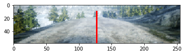
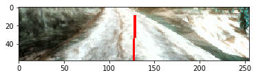
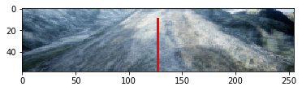
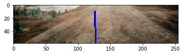
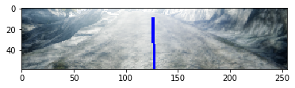
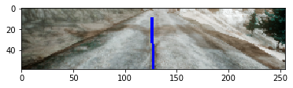

# Step 1 - 模型训练

现在我们对正在处理的数据有了一些感觉，可以开始设计我们的模型了。在本笔记本中，我们将定义网络架构并训练模型。我们还将讨论数据上的一些转换，以回应我们在笔记本的数据探索部分所做的观察。

让我们从导入一些库和定义一些路径开始。


```python
from keras.preprocessing.image import ImageDataGenerator
from keras.models import Sequential, Model
from keras.layers import Conv2D, MaxPooling2D, Dropout, Flatten, Dense, Lambda, Input, concatenate
from keras.layers.normalization import BatchNormalization
from keras.layers.advanced_activations import ELU
from keras.optimizers import Adam, SGD, Adamax, Nadam
from keras.callbacks import ReduceLROnPlateau, ModelCheckpoint, CSVLogger, EarlyStopping
import keras.backend as K
from keras.preprocessing import image

from keras_tqdm import TQDMNotebookCallback

import json
import os
import numpy as np
import pandas as pd
from Generator import DriveDataGenerator
from Cooking import checkAndCreateDir
import h5py
from PIL import Image, ImageDraw
import math
import matplotlib.pyplot as plt

# << 配置前一步预处理好的数据集目录 >>
COOKED_DATA_DIR = '../../AirSim/EndToEndLearningRawData/data_cooked/'

# << 模型文件输出目录：随着梯度越来越小，模型会逐步更新 >>
MODEL_OUTPUT_DIR = 'model'
```

    Using TensorFlow backend.
    E:\Tools\Anaconda3\envs\airsim2\lib\site-packages\tensorflow\python\framework\dtypes.py:493: FutureWarning: Passing (type, 1) or '1type' as a synonym of type is deprecated; in a future version of numpy, it will be understood as (type, (1,)) / '(1,)type'.
      _np_qint8 = np.dtype([("qint8", np.int8, 1)])
    E:\Tools\Anaconda3\envs\airsim2\lib\site-packages\tensorflow\python\framework\dtypes.py:494: FutureWarning: Passing (type, 1) or '1type' as a synonym of type is deprecated; in a future version of numpy, it will be understood as (type, (1,)) / '(1,)type'.
      _np_quint8 = np.dtype([("quint8", np.uint8, 1)])
    E:\Tools\Anaconda3\envs\airsim2\lib\site-packages\tensorflow\python\framework\dtypes.py:495: FutureWarning: Passing (type, 1) or '1type' as a synonym of type is deprecated; in a future version of numpy, it will be understood as (type, (1,)) / '(1,)type'.
      _np_qint16 = np.dtype([("qint16", np.int16, 1)])
    E:\Tools\Anaconda3\envs\airsim2\lib\site-packages\tensorflow\python\framework\dtypes.py:496: FutureWarning: Passing (type, 1) or '1type' as a synonym of type is deprecated; in a future version of numpy, it will be understood as (type, (1,)) / '(1,)type'.
      _np_quint16 = np.dtype([("quint16", np.uint16, 1)])
    E:\Tools\Anaconda3\envs\airsim2\lib\site-packages\tensorflow\python\framework\dtypes.py:497: FutureWarning: Passing (type, 1) or '1type' as a synonym of type is deprecated; in a future version of numpy, it will be understood as (type, (1,)) / '(1,)type'.
      _np_qint32 = np.dtype([("qint32", np.int32, 1)])
    E:\Tools\Anaconda3\envs\airsim2\lib\site-packages\tensorflow\python\framework\dtypes.py:502: FutureWarning: Passing (type, 1) or '1type' as a synonym of type is deprecated; in a future version of numpy, it will be understood as (type, (1,)) / '(1,)type'.
      np_resource = np.dtype([("resource", np.ubyte, 1)])
    

让我们读探索阶段的数据集。如果不存在，运行[上一步](dataexplorationandprepare .ipynb)笔记本中的代码片段来生成它们。


```python
train_dataset = h5py.File(os.path.join(COOKED_DATA_DIR, 'train.h5'), 'r')
eval_dataset = h5py.File(os.path.join(COOKED_DATA_DIR, 'eval.h5'), 'r')
test_dataset = h5py.File(os.path.join(COOKED_DATA_DIR, 'test.h5'), 'r')

num_train_examples = train_dataset['image'].shape[0]
num_eval_examples = eval_dataset['image'].shape[0]
num_test_examples = test_dataset['image'].shape[0]

batch_size=32
```

对于图像数据，将整个数据集加载到内存中代价太大。幸运的是，Keras有DataGenerators的概念。DataGenerator只不过是一个迭代器，它将以块的形式从磁盘读取数据。这允许您保持您的CPU和GPU繁忙，增加吞吐量。
我们在探索阶段做了一些观察。现在，让我们想出一个策略，将它们纳入我们的训练算法:
- **只有图像的一小部分是感兴趣的（ROI）** -当生成批量时，我们可以删除图像中不感兴趣的部分。
- **数据集显示垂直翻转公差** -当生成批量时，我们可以随机翻转一些图像和Y轴周围的标签，以便模型有新的数据学习。
- **数据集应该对照明的变化保持不变** -当生成批量时，我们可以随机增加或删除图像的亮度，这样模型就可以知道照明的全局变化应该被忽略。
- **数据集有很高比例的零值图像** -当生成批量时，我们可以随机降低一个百分比的数据点，其中转向角度为零，这样模型在训练时看到一个平衡的数据集。
- **从我们的数据集中我们需要转向策略的例子，以便模型学习如何急剧转向** -我们在预处理阶段处理这个问题。
虽然Keras有一些标准的内置图像转换，但它们还不足以满足我们的目的。例如，当在标准的ImageDataGenerator中使用horizontal_flip = True时，标签的符号不会倒过来。幸运的是，我们可以扩展ImageDataGenerator类并实现我们自己的转换逻辑。这样做的代码在Generator.py中——它很简单，但是太长了，不能包含在本笔记本中。
这里，我们将用以下参数初始化生成器:
- **Zero_Drop_Percentage: 0.9**—也就是说，我们将随机丢弃标签为0的90%的数据点
- **Brighten_Range: 0.4** -也就是说，每个图像的亮度将被修改高达40%。为了计算“亮度”，我们将图像从RGB空间转换到HSV空间，将“V”坐标上下缩放，再转换回RGB空间。
- **ROI:[76,135,0,255]** -这是x1, x2, y1, y2矩形，表示图像感兴趣的区域。

**思考练习1.1**
试着摆弄一下这些参数，看看是否能得到更好的结果。


```python
data_generator = DriveDataGenerator(rescale=1./255., horizontal_flip=True, brighten_range=0.4)
train_generator = data_generator.flow\
    (train_dataset['image'], train_dataset['previous_state'], train_dataset['label'], batch_size=batch_size, zero_drop_percentage=0.95, roi=[76,135,0,255])
eval_generator = data_generator.flow\
    (eval_dataset['image'], eval_dataset['previous_state'], eval_dataset['label'], batch_size=batch_size, zero_drop_percentage=0.95, roi=[76,135,0,255])    
```

让我们看看一批样品。转向角度用图中红线表示:


```python
def draw_image_with_label(img, label, prediction=None):
    theta = label * 0.69 #Steering range for the car is +- 40 degrees -> 0.69 radians
    line_length = 50
    line_thickness = 3
    label_line_color = (255, 0, 0)
    prediction_line_color = (0, 0, 255)
    pil_image = image.array_to_img(img, K.image_data_format(), scale=True)
    print('Actual Steering Angle = {0}'.format(label))
    draw_image = pil_image.copy()
    image_draw = ImageDraw.Draw(draw_image)
    first_point = (int(img.shape[1]/2),img.shape[0])
    second_point = (int((img.shape[1]/2) + (line_length * math.sin(theta))), int(img.shape[0] - (line_length * math.cos(theta))))
    image_draw.line([first_point, second_point], fill=label_line_color, width=line_thickness)
    
    if (prediction is not None):
        print('Predicted Steering Angle = {0}'.format(prediction))
        print('L1 Error: {0}'.format(abs(prediction-label)))
        theta = prediction * 0.69
        second_point = (int((img.shape[1]/2) + (line_length * math.sin(theta))), int(img.shape[0] - (line_length * math.cos(theta))))
        image_draw.line([first_point, second_point], fill=prediction_line_color, width=line_thickness)
    
    del image_draw
    plt.imshow(draw_image)
    plt.show()

[sample_batch_train_data, sample_batch_test_data] = next(train_generator)
for i in range(0, 3, 1):
    draw_image_with_label(sample_batch_train_data[0][i], sample_batch_test_data[i])
```

    Actual Steering Angle = [0.011892]
    





    Actual Steering Angle = [0.033569]
    





    Actual Steering Angle = [0.00726667]
    





接下来，让我们定义网络架构。我们将使用一个标准的结合卷积/max池化层来处理图片(我们不能进入其中每一层所做的细节在这里,但是你一定要看看这本书中提到的readme文件如果你不理解发生了什么)。然后，我们将把车辆的最后已知状态注入神经网络层作为一个附加特征。图层大小和优化参数是通过实验确定的——尝试调整它们，看看会发生什么!


```python
image_input_shape = sample_batch_train_data[0].shape[1:]
state_input_shape = sample_batch_train_data[1].shape[1:]
activation = 'relu'

#Create the convolutional stacks
pic_input = Input(shape=image_input_shape)

img_stack = Conv2D(16, (3, 3), name="convolution0", padding='same', activation=activation)(pic_input)
img_stack = MaxPooling2D(pool_size=(2,2))(img_stack)
img_stack = Conv2D(32, (3, 3), activation=activation, padding='same', name='convolution1')(img_stack)
img_stack = MaxPooling2D(pool_size=(2, 2))(img_stack)
img_stack = Conv2D(32, (3, 3), activation=activation, padding='same', name='convolution2')(img_stack)
img_stack = MaxPooling2D(pool_size=(2, 2))(img_stack)
img_stack = Flatten()(img_stack)
img_stack = Dropout(0.2)(img_stack)

#Inject the state input
state_input = Input(shape=state_input_shape)
merged = concatenate([img_stack, state_input])

# Add a few dense layers to finish the model
merged = Dense(64, activation=activation, name='dense0')(merged)
merged = Dropout(0.2)(merged)
merged = Dense(10, activation=activation, name='dense2')(merged)
merged = Dropout(0.2)(merged)
merged = Dense(1, name='output')(merged)

adam = Nadam(lr=0.0001, beta_1=0.9, beta_2=0.999, epsilon=1e-08)
model = Model(inputs=[pic_input, state_input], outputs=merged)
model.compile(optimizer=adam, loss='mse')
```

    WARNING:tensorflow:From E:\Tools\Anaconda3\envs\airsim2\lib\site-packages\keras\backend\tensorflow_backend.py:1264: calling reduce_prod (from tensorflow.python.ops.math_ops) with keep_dims is deprecated and will be removed in a future version.
    Instructions for updating:
    keep_dims is deprecated, use keepdims instead
    WARNING:tensorflow:From E:\Tools\Anaconda3\envs\airsim2\lib\site-packages\keras\backend\tensorflow_backend.py:1349: calling reduce_mean (from tensorflow.python.ops.math_ops) with keep_dims is deprecated and will be removed in a future version.
    Instructions for updating:
    keep_dims is deprecated, use keepdims instead
    

Let's look at a summary of our model


```python
model.summary()
```

    __________________________________________________________________________________________________
    Layer (type)                    Output Shape         Param #     Connected to                     
    ==================================================================================================
    input_1 (InputLayer)            (None, 59, 255, 3)   0                                            
    __________________________________________________________________________________________________
    convolution0 (Conv2D)           (None, 59, 255, 16)  448         input_1[0][0]                    
    __________________________________________________________________________________________________
    max_pooling2d_1 (MaxPooling2D)  (None, 29, 127, 16)  0           convolution0[0][0]               
    __________________________________________________________________________________________________
    convolution1 (Conv2D)           (None, 29, 127, 32)  4640        max_pooling2d_1[0][0]            
    __________________________________________________________________________________________________
    max_pooling2d_2 (MaxPooling2D)  (None, 14, 63, 32)   0           convolution1[0][0]               
    __________________________________________________________________________________________________
    convolution2 (Conv2D)           (None, 14, 63, 32)   9248        max_pooling2d_2[0][0]            
    __________________________________________________________________________________________________
    max_pooling2d_3 (MaxPooling2D)  (None, 7, 31, 32)    0           convolution2[0][0]               
    __________________________________________________________________________________________________
    flatten_1 (Flatten)             (None, 6944)         0           max_pooling2d_3[0][0]            
    __________________________________________________________________________________________________
    dropout_1 (Dropout)             (None, 6944)         0           flatten_1[0][0]                  
    __________________________________________________________________________________________________
    input_2 (InputLayer)            (None, 4)            0                                            
    __________________________________________________________________________________________________
    concatenate_1 (Concatenate)     (None, 6948)         0           dropout_1[0][0]                  
                                                                     input_2[0][0]                    
    __________________________________________________________________________________________________
    dense0 (Dense)                  (None, 64)           444736      concatenate_1[0][0]              
    __________________________________________________________________________________________________
    dropout_2 (Dropout)             (None, 64)           0           dense0[0][0]                     
    __________________________________________________________________________________________________
    dense2 (Dense)                  (None, 10)           650         dropout_2[0][0]                  
    __________________________________________________________________________________________________
    dropout_3 (Dropout)             (None, 10)           0           dense2[0][0]                     
    __________________________________________________________________________________________________
    output (Dense)                  (None, 1)            11          dropout_3[0][0]                  
    ==================================================================================================
    Total params: 459,733
    Trainable params: 459,733
    Non-trainable params: 0
    __________________________________________________________________________________________________
    

这有很多参数!幸运的是，我们有自己的数据增强策略，因此网络有机会融合。尝试添加/删除层或改变它们的宽度，看看它对网络中可训练参数的数量有什么影响。

Keras的一个很好的特性是声明回调的能力。这些函数在训练的每个阶段之后执行。我们将定义几个回调函数:
- **ReduceLrOnPlateau** -如果模型接近最小值，而学习速率太高，那么模型将围绕最小值旋转而永远达不到它。当验证损失停止改善时，这个回调将允许我们降低学习率，从而使我们达到最佳点。
- **CsvLogger** -这让我们可以在每个epoch之后记录模型的输出，这将允许我们在不需要使用控制台的情况下跟踪进程。
- **ModelCheckpoint** -通常，我们希望使用在验证集中损失最小的模型。每次验证损失改善时，这个回调将保存模型。
- **及早停止** -当验证损失停止改善时，我们将希望停止训练。否则，我们就有过度拟合的风险。该监视器将检测验证损失何时停止改善，并在发生这种情况时停止训练过程。


```python
plateau_callback = ReduceLROnPlateau(monitor='val_loss', factor=0.5, patience=3, min_lr=0.0001, verbose=1)
checkpoint_filepath = os.path.join(MODEL_OUTPUT_DIR, 'models', '{0}_model.{1}-{2}.h5'.format('model', '{epoch:02d}', '{val_loss:.7f}'))
checkAndCreateDir(checkpoint_filepath)
checkpoint_callback = ModelCheckpoint(checkpoint_filepath, save_best_only=True, verbose=1)
csv_callback = CSVLogger(os.path.join(MODEL_OUTPUT_DIR, 'training_log.csv'))
early_stopping_callback = EarlyStopping(monitor='val_loss', patience=10, verbose=1)
callbacks=[plateau_callback, csv_callback, checkpoint_callback, early_stopping_callback, TQDMNotebookCallback()]
```

是时候训练模型了!在默认设置下，该模型在NVidia GTX970 GPU上训练大约需要45分钟。注:有时模型会被一个长达7个epoch的恒定验证损失卡住。如果让模型继续运行，那么模型应该以大约0.0003的验证损失结束。


```python
history = model.fit_generator(train_generator, steps_per_epoch=num_train_examples//batch_size, epochs=500, callbacks=callbacks,\
                   validation_data=eval_generator, validation_steps=num_eval_examples//batch_size, verbose=2)
```


    Training:   0%|          | 0/500 [00:00<?, ?it/s]


    Epoch 0:   0%|          | 0/1021 [00:00<?, ?it/s]


    Epoch 1/500
    Epoch 00001: val_loss improved from inf to 0.02272, saving model to model\models\model_model.01-0.0227211.h5
     - 255s - loss: 0.0227 - val_loss: 0.0227
    


    Epoch 1:   0%|          | 0/1021 [00:00<?, ?it/s]


    Epoch 2/500
    Epoch 00002: val_loss did not improve
     - 263s - loss: 0.0224 - val_loss: 0.0227
    


    Epoch 2:   0%|          | 0/1021 [00:00<?, ?it/s]


    Epoch 3/500
    Epoch 00003: val_loss improved from 0.02272 to 0.02272, saving model to model\models\model_model.03-0.0227178.h5
     - 261s - loss: 0.0225 - val_loss: 0.0227
    


    Epoch 3:   0%|          | 0/1021 [00:00<?, ?it/s]


    Epoch 4/500
    Epoch 00004: val_loss improved from 0.02272 to 0.01308, saving model to model\models\model_model.04-0.0130766.h5
     - 247s - loss: 0.0214 - val_loss: 0.0131
    


    Epoch 4:   0%|          | 0/1021 [00:00<?, ?it/s]


    Epoch 5/500
    Epoch 00005: val_loss improved from 0.01308 to 0.00285, saving model to model\models\model_model.05-0.0028456.h5
     - 255s - loss: 0.0072 - val_loss: 0.0028
    


    Epoch 5:   0%|          | 0/1021 [00:00<?, ?it/s]


    Epoch 6/500
    Epoch 00006: val_loss improved from 0.00285 to 0.00107, saving model to model\models\model_model.06-0.0010740.h5
     - 275s - loss: 0.0036 - val_loss: 0.0011
    


    Epoch 6:   0%|          | 0/1021 [00:00<?, ?it/s]


    Epoch 7/500
    Epoch 00007: val_loss improved from 0.00107 to 0.00070, saving model to model\models\model_model.07-0.0006958.h5
     - 276s - loss: 0.0027 - val_loss: 6.9578e-04
    


    Epoch 7:   0%|          | 0/1021 [00:00<?, ?it/s]


    Epoch 8/500
    Epoch 00008: val_loss improved from 0.00070 to 0.00051, saving model to model\models\model_model.08-0.0005139.h5
     - 269s - loss: 0.0024 - val_loss: 5.1388e-04
    


    Epoch 8:   0%|          | 0/1021 [00:00<?, ?it/s]


    Epoch 9/500
    Epoch 00009: val_loss improved from 0.00051 to 0.00047, saving model to model\models\model_model.09-0.0004663.h5
     - 256s - loss: 0.0020 - val_loss: 4.6628e-04
    


    Epoch 9:   0%|          | 0/1021 [00:00<?, ?it/s]


    Epoch 10/500
    Epoch 00010: val_loss improved from 0.00047 to 0.00032, saving model to model\models\model_model.10-0.0003200.h5
     - 254s - loss: 0.0019 - val_loss: 3.1998e-04
    


    Epoch 10:   0%|          | 0/1021 [00:00<?, ?it/s]


    Epoch 11/500
    Epoch 00011: val_loss did not improve
     - 260s - loss: 0.0018 - val_loss: 4.4795e-04
    


    Epoch 11:   0%|          | 0/1021 [00:00<?, ?it/s]


    Epoch 12/500
    Epoch 00012: val_loss improved from 0.00032 to 0.00030, saving model to model\models\model_model.12-0.0003030.h5
     - 249s - loss: 0.0017 - val_loss: 3.0302e-04
    


    Epoch 12:   0%|          | 0/1021 [00:00<?, ?it/s]


    Epoch 13/500
    Epoch 00013: val_loss improved from 0.00030 to 0.00024, saving model to model\models\model_model.13-0.0002441.h5
     - 245s - loss: 0.0017 - val_loss: 2.4407e-04
    


    Epoch 13:   0%|          | 0/1021 [00:00<?, ?it/s]


    Epoch 14/500
    Epoch 00014: val_loss did not improve
     - 241s - loss: 0.0017 - val_loss: 2.6870e-04
    


    Epoch 14:   0%|          | 0/1021 [00:00<?, ?it/s]


    Epoch 15/500
    Epoch 00015: val_loss did not improve
     - 237s - loss: 0.0017 - val_loss: 2.5549e-04
    


    Epoch 15:   0%|          | 0/1021 [00:00<?, ?it/s]


    Epoch 16/500
    Epoch 00016: val_loss did not improve
     - 237s - loss: 0.0017 - val_loss: 2.9856e-04
    


    Epoch 16:   0%|          | 0/1021 [00:00<?, ?it/s]


    Epoch 17/500
    Epoch 00017: val_loss did not improve
     - 237s - loss: 0.0017 - val_loss: 2.6887e-04
    


    Epoch 17:   0%|          | 0/1021 [00:00<?, ?it/s]


    Epoch 18/500
    Epoch 00018: val_loss did not improve
     - 237s - loss: 0.0016 - val_loss: 2.9193e-04
    


    Epoch 18:   0%|          | 0/1021 [00:00<?, ?it/s]


    Epoch 19/500
    Epoch 00019: val_loss did not improve
     - 238s - loss: 0.0016 - val_loss: 3.0518e-04
    


    Epoch 19:   0%|          | 0/1021 [00:00<?, ?it/s]


    Epoch 20/500
    


    ---------------------------------------------------------------------------

    KeyboardInterrupt                         Traceback (most recent call last)

    <ipython-input-8-50126e7d2d8b> in <module>
          1 history = model.fit_generator(train_generator, steps_per_epoch=num_train_examples//batch_size, epochs=500, callbacks=callbacks,\
    ----> 2                    validation_data=eval_generator, validation_steps=num_eval_examples//batch_size, verbose=2)
    

    E:\Tools\Anaconda3\envs\airsim2\lib\site-packages\keras\legacy\interfaces.py in wrapper(*args, **kwargs)
         85                 warnings.warn('Update your `' + object_name +
         86                               '` call to the Keras 2 API: ' + signature, stacklevel=2)
    ---> 87             return func(*args, **kwargs)
         88         wrapper._original_function = func
         89         return wrapper
    

    E:\Tools\Anaconda3\envs\airsim2\lib\site-packages\keras\engine\training.py in fit_generator(self, generator, steps_per_epoch, epochs, verbose, callbacks, validation_data, validation_steps, class_weight, max_queue_size, workers, use_multiprocessing, shuffle, initial_epoch)
       2145                     outs = self.train_on_batch(x, y,
       2146                                                sample_weight=sample_weight,
    -> 2147                                                class_weight=class_weight)
       2148 
       2149                     if not isinstance(outs, list):
    

    E:\Tools\Anaconda3\envs\airsim2\lib\site-packages\keras\engine\training.py in train_on_batch(self, x, y, sample_weight, class_weight)
       1837             ins = x + y + sample_weights
       1838         self._make_train_function()
    -> 1839         outputs = self.train_function(ins)
       1840         if len(outputs) == 1:
       1841             return outputs[0]
    

    E:\Tools\Anaconda3\envs\airsim2\lib\site-packages\keras\backend\tensorflow_backend.py in __call__(self, inputs)
       2355         session = get_session()
       2356         updated = session.run(fetches=fetches, feed_dict=feed_dict,
    -> 2357                               **self.session_kwargs)
       2358         return updated[:len(self.outputs)]
       2359 
    

    E:\Tools\Anaconda3\envs\airsim2\lib\site-packages\tensorflow\python\client\session.py in run(self, fetches, feed_dict, options, run_metadata)
        893     try:
        894       result = self._run(None, fetches, feed_dict, options_ptr,
    --> 895                          run_metadata_ptr)
        896       if run_metadata:
        897         proto_data = tf_session.TF_GetBuffer(run_metadata_ptr)
    

    E:\Tools\Anaconda3\envs\airsim2\lib\site-packages\tensorflow\python\client\session.py in _run(self, handle, fetches, feed_dict, options, run_metadata)
       1126     if final_fetches or final_targets or (handle and feed_dict_tensor):
       1127       results = self._do_run(handle, final_targets, final_fetches,
    -> 1128                              feed_dict_tensor, options, run_metadata)
       1129     else:
       1130       results = []
    

    E:\Tools\Anaconda3\envs\airsim2\lib\site-packages\tensorflow\python\client\session.py in _do_run(self, handle, target_list, fetch_list, feed_dict, options, run_metadata)
       1342     if handle is None:
       1343       return self._do_call(_run_fn, self._session, feeds, fetches, targets,
    -> 1344                            options, run_metadata)
       1345     else:
       1346       return self._do_call(_prun_fn, self._session, handle, feeds, fetches)
    

    E:\Tools\Anaconda3\envs\airsim2\lib\site-packages\tensorflow\python\client\session.py in _do_call(self, fn, *args)
       1348   def _do_call(self, fn, *args):
       1349     try:
    -> 1350       return fn(*args)
       1351     except errors.OpError as e:
       1352       message = compat.as_text(e.message)
    

    E:\Tools\Anaconda3\envs\airsim2\lib\site-packages\tensorflow\python\client\session.py in _run_fn(session, feed_dict, fetch_list, target_list, options, run_metadata)
       1327           return tf_session.TF_Run(session, options,
       1328                                    feed_dict, fetch_list, target_list,
    -> 1329                                    status, run_metadata)
       1330 
       1331     def _prun_fn(session, handle, feed_dict, fetch_list):
    

    KeyboardInterrupt: 


让我们做一个快速的检查。我们将加载一些训练图像，并比较标签和预测。如果我们的模型学习得当，这些值应该非常接近。


```python
[sample_batch_train_data, sample_batch_test_data] = next(train_generator)
predictions = model.predict([sample_batch_train_data[0], sample_batch_train_data[1]])
for i in range(0, 3, 1):
    draw_image_with_label(sample_batch_train_data[0][i], sample_batch_test_data[i], predictions[i])
```

    Actual Steering Angle = [-0.03708]
    Predicted Steering Angle = [-0.02686657]
    L1 Error: [0.01021343]
    





    Actual Steering Angle = [-0.02100967]
    Predicted Steering Angle = [-0.01909251]
    L1 Error: [0.00191716]
    





    Actual Steering Angle = [-0.03047433]
    Predicted Steering Angle = [-0.03524271]
    L1 Error: [0.00476837]
    





看起来不错!让我们继续在[下一个笔记本](TestModel.ipynb)中使用AirSim实际运行模型。
